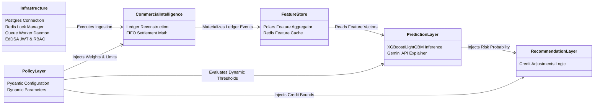

# Econiq Core: Backend Architecture Specification

This document defines the backend architecture blueprint for **Econiq Core**, separating invariant infrastructure from commercial intelligence calculators, rules profiles, and future predictive layers. It serves as the authoritative architectural guidelines for developers and operators.

---

## 1. Architectural Blueprint Overview

Econiq Core is organized as a modular monolithic backend daemon running the FastAPI web server concurrently with background synchronization and recomputation queues.

```
                  ┌─────────────────────────────────┐
                  │          FastAPI Server         │ (API Gateway & Web Entry)
                  └────────────────┬────────────────┘
                                   │
                  ┌────────────────▼────────────────┐
                  │      Orchestration Engine       │ (Intelligence Orchestrator)
                  └───────┬─────────────────┬───────┘
                           │                 │
     ┌─────────────────────▼────┐      ┌─────▼────────────────────┐
     │  Commercial Intel Core   │      │      Policy Layer        │
     │  - Ledger Reconstruction │      │      - Dynamic Profiles  │
     │  - FIFO Settlement Engine│      │      - Pydantic Models   │
     │  - Invariant Accounting  │      │      - Parameter Configs │
     └─────────────┬────────────┘      └─────────────┬────────────┘
                   │                                 │
     ┌─────────────▼────────────┐      ┌─────────────▼────────────┐
     │      Feature Store       │      │     Prediction Layer     │
     │  - Polars Aggregator     │      │      - XGBoost/LightGBM  │
     │  - Redis Online Cache    │──────▶      - ML Serving Wrapper│
     │  - Anchor Row Evaluator  │      │      - Gemini Explainer  │
     └─────────────┬────────────┘      └─────────────┬────────────┘
                   │                                 │
     ┌─────────────▼────────────┐      ┌─────────────▼────────────┐
     │   Recommendation Layer   │      │    Observability Layer   │
     │   - Credit Adjustments   │      │    - Prometheus Metrics  │
     │   - Collections Routing  │      │    - Structured Loguru   │
     └──────────────────────────┘      └──────────────────────────┘
```

---

## 2. Core Architecture Layers

### 2.1 Infrastructure Core
*   **Responsibility:** Provides data persistence, session management, transaction concurrency, multi-tenant separation, rate limiting, and queue orchestration.
*   **Key Components:**
    *   **PostgreSQL Adapter:** Managed via `SQLAlchemy` async sessions, providing high-performance connection pooling (size: 10, max overflow: 20, timeout: 30s) over PostgreSQL using `asyncpg`.
    *   **Redis Engine:** Manages feature caching (Feature Store) and distributed advisory locking (`SyncLock` and context manager wrappers) to prevent race conditions during synchronous updates.
    *   **Queue Worker Loop:** Claims and processes pending calculation tasks from `customer_recomputation_queue` using `FOR UPDATE SKIP LOCKED` database queries, enabling scalable background concurrency.
    *   **Security & RBAC:** Secure EdDSA JWT key validation, role-based access control, API Key authentication, and IP-level/endpoint-level rate-limiting middlewares.
*   **Ownership:** Infrastructure & DevOps Team.

### 2.2 Commercial Intelligence Core
*   **Responsibility:** Defines invariant financial ledger reconstruction rules, transaction sequencing, and chronological rolling aggregations.
*   **Key Components:**
    *   **Ledger Reconstruction Engine:** Materializes delta events (`SALE`, `PAYMENT`, `RETURN`, `DISCOUNT`, `OPENING_BALANCE`) into `event_ledger` to calculate daily outstanding exposure.
    *   **Settlement Matching Engine:** Chronologically matches payments against unpaid sales invoices using a First-In, First-Out (FIFO) algorithm to compute repayment duration and lag trends per customer.
*   **Invariant Philosophy:** These modules represent fixed accounting principles and mathematics. They do not contain company-specific parameters, weights, or heuristic classifications.
*   **Ownership:** Financial Engineering Team.

### 2.3 Policy Layer (Policy Engine)
*   **Responsibility:** Decouples organization-specific parameters (such as state boundaries, grading thresholds, and stress weights) from execution code, loading configurations dynamically from database policies or local configurations at runtime.
*   **Key Components:**
    *   **Policy Manager:** Loads tenant configuration profiles into validated Pydantic models.
    *   **Dynamic Classifications:** Configurable thresholds for states (`elite`, `active`, `declining`, `irregular`, `inactive`), trajectory velocity ratios (`ACCELERATING`, `GROWING`, `DECLINING`, `COLLAPSING`), and trust bands.
    *   **Configurable Weights:** Scoring weights (e.g., purchase vs. payment weight ratios), return goods responsibility weights (Customer vs. Genuine fault), outstanding stress thresholds, and credit day breach limits.
*   **Ownership:** Architecture & Systems Team.

### 2.4 Feature Layer (Feature Store)
*   **Responsibility:** Vectorized calculations of statistical indicators and caching of rolling feature matrices in Redis for immediate ML inference and UI hydration.
*   **Key Components:**
    *   **Polars Aggregator:** Vectorized rolling aggregation calculations over sliding windows (e.g., 180-day overall window and 30-day recent window) utilizing Polars' high-performance expressions.
    *   **Anchor Row Injector:** Injects an "anchor row" representing the evaluation date to capture silence periods (non-activity) as a signal of churn.
    *   **Online Feature Cache:** Dynamic feature store interfaces exposed to ML scoring routines and stored in Redis.
*   **Ownership:** ML Platform & Data Engineering Team.

### 2.5 Prediction Layer (AI/ML)
*   **Responsibility:** Serves real-time ML inferences and generates natural language explanation summaries.
*   **Key Components:**
    *   **Prediction Service:** Loads serialized ML models (XGBoost/LightGBM) from disk to evaluate 90-day Default Risk (PD), Churn probability, sales growth trend, and collections recovery prioritization.
    *   **Gemini Explainer:** Hydrates prompt contexts with structured JSON feature store metrics to generate conversational summaries and risk explanations via the Gemini API.
*   **Ownership:** AI & Data Science Team.

### 2.6 Recommendation Layer
*   **Responsibility:** Evaluates predictive risk states and policy bounds to suggest specific commercial actions.
*   **Key Components:**
    *   **Credit Rules Evaluator:** Suggests credit terms changes, credit limit increases or decreases, and risk flags.
    *   **Collections Priority Router:** Suggests recovery priority and actions for delinquent customers.
*   **Ownership:** Commercial Operations Team.

### 2.7 Observability Layer
*   **Responsibility:** Systems metrics collection, structured logging telemetry, and performance tracing.
*   **Key Components:**
    *   **Structured Logger:** Async file rotations and JSON formatting via `Loguru`.
    *   **Prometheus Metrics:** Endpoints tracking API latency (target sub-200ms), background queue recomputation rates, queue lag, and cache hit/miss rates.
*   **Ownership:** SRE & Operations Team.

---

## 3. Module Boundaries & Dependencies

To prevent coupling and maintain evolvability, imports between layers must conform to strict boundaries:



### Strict Architectural Decoupling Rules:
1.  **Rule 1:** The `CommercialIntelligence` and `FeatureStore` modules must have no dependency on the `PredictionLayer`. They calculate invariant rolling vectors and accounting ledger events.
2.  **Rule 2:** The `PolicyLayer` must remain self-contained, parsing configuration profiles and injecting them into the scoring engine runtimes.
3.  **Rule 3:** The `PredictionLayer` depends on the outputs of the `FeatureStore` (to fetch inference vectors) and `PolicyLayer` (to fetch model thresholds).
4.  **Rule 4:** `Ingestion` normalizes raw transaction changes and appends them to the ledger. It triggers background recomputation tasks via the queue without calling the intelligence scoring directly.

---

## 4. Performance & Scalability Targets

> [!IMPORTANT]
> The target deployment stack is hosted on **Railway**, requiring efficient memory and CPU usage.

*   **API Latency:** Sub-200ms standard API response times achieved by serving precomputed metrics from PostgreSQL and cached feature vectors from Redis.
*   **Queue Processing:** Background recomputations must process in <100ms per customer to avoid thread contention.
*   **Concurrency:** Advisory locks ensure that a single customer's ledger is never recomputed by multiple workers concurrently.
*   **Scalability:** Single deployable FastAPI monolithic image running web servers and background queue workers on independent threads or processes.
