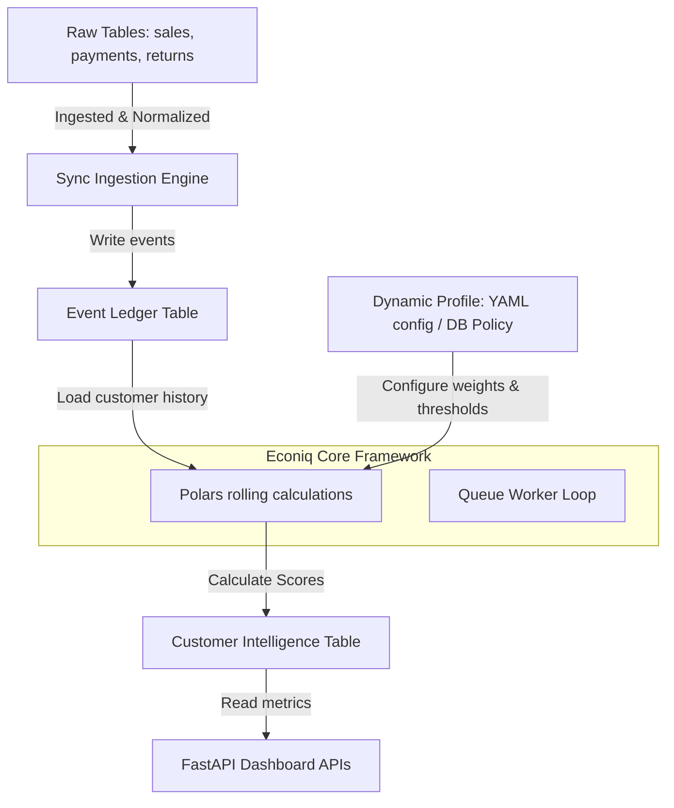

# Econiq Core Platform Kernel Extraction

This document outlines the components in the legacy econiq backend that will be preserved as the permanent foundation of the **Econiq Core Platform**. These components are independent of specific client organizations and handle core capabilities like identity, data normalization, ledger materialization, and batch scheduling.

---

## 1. Econiq Core Architecture Components

The invariant technical infrastructure of the platform is decomposed below, showing keep/reuse percentages, engineering complexity, and architectural value.

### 1.1 Ingestion & Normalization Framework
*   **Module Path:** [ingestion/](file:///home/sugarcube/Desktop/Documents/Code-Server/Hackathon%20Projects/India-Runs/ECON-IQ/Econ-Core/ref/app/ingestion) & [normalization/](file:///home/sugarcube/Desktop/Documents/Code-Server/Hackathon%20Projects/India-Runs/ECON-IQ/Econ-Core/ref/app/normalization)
*   **Description:** Asynchronous DB providers, schema checkers, string-to-date converters, and database mapping rules.
*   **Keep Ratio:** 95%
*   **Reuse Ratio:** 90% (Adjust mapping fields to generic names: receipts $\rightarrow$ payments).
*   **Complexity:** Medium
*   **Business Value:** High. Standardizes inconsistent data inputs from disparate databases into clean, structured records.

### 1.2 Ledger Reconstruction Pipeline
*   **Module Path:** [ledger/](file:///home/sugarcube/Desktop/Documents/Code-Server/Hackathon%20Projects/India-Runs/ECON-IQ/Econ-Core/ref/app/ledger) & [intelligence/ledger/reconstruction.py](file:///home/sugarcube/Desktop/Documents/Code-Server/Hackathon%20Projects/India-Runs/ECON-IQ/Econ-Core/ref/app/intelligence/ledger/reconstruction.py)
*   **Description:** Reconstructs the chronological financial timeline of transactions for any given customer, calculating daily rolling outstanding exposure.
*   **Keep Ratio:** 100%
*   **Reuse Ratio:** 100% (Pure accounting logic, completely invariant across organizations).
*   **Complexity:** High
*   **Business Value:** Critical. Formulates the historical delta ledger required for all downstream risk calculations and models.

### 1.3 Asynchronous Queue Worker & Lock Manager
*   **Module Path:** [intelligence/queue_worker.py](file:///home/sugarcube/Desktop/Documents/Code-Server/Hackathon%20Projects/India-Runs/ECON-IQ/Econ-Core/ref/app/intelligence/queue_worker.py) & [utils/lock_manager.py](file:///home/sugarcube/Desktop/Documents/Code-Server/Hackathon%20Projects/India-Runs/ECON-IQ/Econ-Core/ref/app/utils/lock_manager.py)
*   **Description:** Uses PostgreSQL advisory locks and Redis distributed locks to coordinate concurrent processing across multiple workers, implementing a high-throughput transaction queue with `FOR UPDATE SKIP LOCKED`.
*   **Keep Ratio:** 100%
*   **Reuse Ratio:** 95% (Needs generic logging references).
*   **Complexity:** High
*   **Business Value:** High. Prevents race conditions during updates and guarantees exactly-once execution for compute-heavy recalculation loops.

### 1.4 Identity, Session Management & RBAC
*   **Module Path:** [api/auth.py](file:///home/sugarcube/Desktop/Documents/Code-Server/Hackathon%20Projects/India-Runs/ECON-IQ/Econ-Core/ref/app/api/auth.py) & [models/auth_models.py](file:///home/sugarcube/Desktop/Documents/Code-Server/Hackathon%20Projects/India-Runs/ECON-IQ/Econ-Core/ref/app/models/auth_models.py)
*   **Description:** Token issuance, secure EdDSA key validation, MFA OTP hooks, API Key validation, and role definitions.
*   **Keep Ratio:** 90%
*   **Reuse Ratio:** 95%
*   **Complexity:** Medium
*   **Business Value:** High. Fully secures all endpoints and establishes multi-tenant context boundaries.

### 1.5 Polars High-Performance Feature Engineering
*   **Module Path:** [features/engineer.py](file:///home/sugarcube/Desktop/Documents/Code-Server/Hackathon%20Projects/India-Runs/ECON-IQ/Econ-Core/ref/app/features/engineer.py)
*   **Description:** Translates thousands of event logs per customer into statistical indicators using vectorized Polars computations.
*   **Keep Ratio:** 100%
*   **Reuse Ratio:** 90%
*   **Complexity:** High
*   **Business Value:** Extremely High. Sub-millisecond mathematical feature aggregations keep latency low and prepare features for ML training.

---

## 2. Core Compatibility Summary Matrix

| Module / Service | Purpose | Keep % | Reuse % | Complexity | Business Value |
| :--- | :--- | :--- | :--- | :--- | :--- |
| **`DBIngestionProvider`** | Reads data from raw transactional source tables | 95% | 90% | Medium | High |
| **`LedgerService`** | Computes transaction sequences and writes ledger | 100% | 100% | High | Critical |
| **`IntelligenceQueueWorker`** | Claims queued customers using database locks | 100% | 95% | High | High |
| **`Auth & RBAC Middleware`** | Secures API endpoints and handles sessions | 90% | 95% | Medium | High |
| **`FeatureEngineer`** | Calculates rolling metrics using Polars | 100% | 90% | High | Critical |
| **`MDBLockManager`** | Synchronizes access between ingestion and sync services | 100% | 100% | Medium | Medium |
| **`IntelligenceRepository`** | Persistence queries for PostgreSQL data | 95% | 90% | Low | Medium |

---

## 3. Platform Generalization Strategy

To transform these modules into **Econiq Core Platform**, we will implement a configuration layer that separates core pipeline mechanics from the business parameters:

> [!TIP]
> Preserving the Polars execution layer as part of **Econiq Core** ensures high performance (sub-200ms processing times), while removing the hardcoded weights allows the platform to support different business profiles out of the box.
