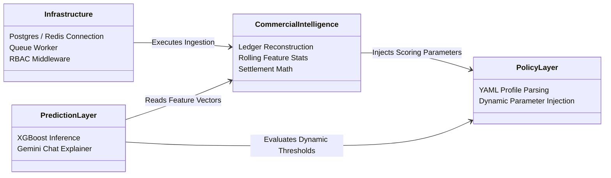

# Core Backend Architecture Specification

This document defines the backend architecture blueprint for **Econiq Core**, separating invariant infrastructure from commercial intelligence calculators, rules profiles, and future predictive layers.

---

## 1. Architectural Blueprint Overview

Econiq Core is organized as a modular monolithic backend daemon running the FastAPI web server concurrently with background synchronization and recomputation queues.

```
                  ┌─────────────────────────────────┐
                  │          FastAPI Server         │ (API Gateway)
                  └────────────────┬────────────────┘
                                   │
                  ┌────────────────▼────────────────┐
                  │      Orchestration Engine       │
                  └───────┬─────────────────┬───────┘
                          │                 │
     ┌────────────────────▼─────┐     ┌─────▼────────────────────┐
     │  Commercial Intel Core   │     │      Policy Layer        │
     │  - Ledger Reconstruction │     │      - Dynamic Profiles  │
     │  - Exposure / Settlement  │     │      - State Transitions │
     │  - Rolling Polars Stats  │     │      - Custom Weights    │
     └──────────────────────────┘     └──────────────────────────┘
                          │                 │
     ┌────────────────────▼─────┐     ┌─────▼────────────────────┐
     │      Feature Layer       │     │     Prediction Layer     │
     │      - Redis Cache Store │     │     - ML Classifiers     │
     │      - Batch Queue Logs  │     │     - Copilot Explainer  │
     └──────────────────────────┘     └──────────────────────────┘
```

---

## 2. Core Architecture Layers

### 2.1 Infrastructure Core
*   **Responsibility:** Provides data persistence, session management, transaction concurrency, multi-tenant separation, rate limiting, and queue orchestration.
*   **Key Assets:**
    *   **PostgreSQL Adapter:** Managed via `SQLAlchemy` async sessions, providing high-performance connection pooling.
    *   **Redis Engine:** Manages distributed advisory locking to prevent race conditions during synchronous updates.
    *   **Queue Worker Loop:** Claims and processes pending calculation tasks from `customer_recomputation_queue` using `FOR UPDATE SKIP LOCKED` database queries.
    *   **Security & RBAC:** Secure EdDSA JWT key validation and role check middlewares.

### 2.2 Commercial Intelligence Core
*   **Responsibility:** Defines invariant financial ledger reconstruction rules, transaction sequencing, and chronological rolling aggregations.
*   **Key Assets:**
    *   **Ledger Reconstruction Engine:** Materializes delta events (`SALE`, `PAYMENT`, `RETURN`, `DISCOUNT`) to calculate daily outstanding exposure.
    *   **Settlement Matching Engine:** Chronologically matches payments against unpaid sales invoices to compute repayment duration and lag trends.
    *   **Cadence & Consistency Engines:** Measures median transaction gaps and deviations.

### 2.3 Policy Layer (Business Profiles)
*   **Responsibility:** decoples organization-specific parameters (such as state parameters, grading thresholds, and stress weights) from execution code, loading configurations dynamically from database policies at runtime.
*   **Key Assets:**
    *   **Policy Manager:** Loads tenant configuration JSON/YAML profiles into validated Pydantic models.
    *   **Configurable State Machine:** Maps customers to behavioral categories (`elite`, `active`, `declining`, `irregular`, `inactive`) based on dynamic limits.

### 2.4 Feature Layer (Feature Store)
*   **Responsibility:** Vectorized calculations of statistical indicators and caching of rolling feature matrices in Redis for immediate ML inference.
*   **Key Assets:**
    *   **Polars Aggregator:** Vectorized rolling aggregation calculations over 365d and 14d sliding windows.
    *   **Online Feature Cache:** Dynamic feature store interfaces exposed to ML scoring routines.

### 2.5 Prediction Layer (AI/ML)
*   **Responsibility:** Loads serialized model files (XGBoost/LightGBM) to evaluate Default Risk, Churn probability, and Priority recovery rankings, and generates natural language explanations via the Gemini API.
*   **Key Assets:**
    *   **Prediction Service:** Loads model binaries and returns inference floats.
    *   **Gemini Explainer:** Hydrates prompt contexts with structured JSON feature store metrics to generate conversational summaries.

### 2.6 Recommendation Layer
*   **Responsibility:** Evaluates predictive risk states to suggest specific credit terms changes, limit adjustments, and collections routing actions.

### 2.7 Observability Layer
*   **Responsibility:** System metrics collection, structured logging telemetry, and performance tracing.
*   **Key Assets:** Loguru async file rotations; Prometheus metrics endpoints.

---

## 3. Module Boundaries & Dependencies

To prevent coupling and maintain evolvability, imports between layers must conform to the following boundaries:



*   **Rule 1:** The `CommercialIntelligence` core modules must have no dependency on the `PredictionLayer`. They calculate invariant rolling vectors.
*   **Rule 2:** The `PolicyLayer` must remain self-contained, parsing settings parameters and injecting them into the scoring engine runtime variables.
*   **Rule 3:** The `PredictionLayer` depends on the output of the `Feature Store` (part of the feature layer) to fetch inference vectors.
