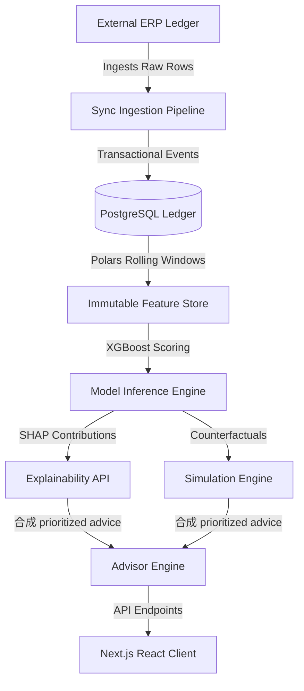

# Hackathon Judges' Walkthrough

Welcome to the EconIQ evaluation guide. This walkthrough outlines the core business problems we solve, our technology stack, and key features to look for during your review.

---

## 1. Product Value Proposition
Standard ERP databases are **passive and retrospective**. They record what happened (sales, delayed payments) but cannot predict defaults or recommend corrective actions.

**EconIQ** is a **Stateful Commercial Decision Intelligence Platform** that continuously observes customer behavior, learns from outcomes, simulates interventions, and recommends optimal commercial actions.

---

## 2. Business Problem & Solution Impact
- **The Problem:** Companies lose millions in cash flow due to late-paying accounts and default risks that standard ledger systems fail to flag early.
- **The Solution:** EconIQ converts simple event listings into an active decision-making system. It aggregates raw transactional timelines, predicts default risks, allows credit managers to test what-if actions, and records override audits for compliance.

---

## 3. Technology Stack

- **Backend:** FastAPI (Python), PostgreSQL, Redis, SQLAlchemy 2.0 (async), Polars.
- **ML Pipeline:** scikit-learn models (Delinquency, Churn, Distress), TreeSHAP explanations.
- **Frontend:** Next.js (TypeScript), TanStack React Query, Axios, TailwindCSS.

---

## 4. Key Areas to Evaluate

### 4.1 8 Canonical Scoring Profile
Inspect how every customer profile is mapped against the standard scoring matrix:
1. **Health Score:** General commercial state.
2. **Risk Score:** Probability of default.
3. **Growth Score:** Up-sell and catalog expansion potential.
4. **Trust Score:** Likeliness to pay invoices on time.
5. **Opportunity Score:** Readiness for larger financing.
6. **Credit Score:** Safe credit limit rating.
7. **Collection Score:** Delinquency recovery urgency.
8. **Relationship Score:** Long-term catalog stability.

### 4.2 Explainable AI (SHAP Factors)
In the customer detail view, click the **ML Cockpit** tab. Look at the positive and negative risk contributors. This ensures model decisions are explainable and auditable.

### 4.3 Counterfactual What-If Simulation
Simulate credit actions in real-time. Slide parameters or select actions to see risk dial changes, showing how manager interventions alter credit outcomes.

### 4.4 Human-in-the-Loop Audit Trail
Override an automated recommendation. The system requires a text justification, creating an immutable log for audit compliance.
