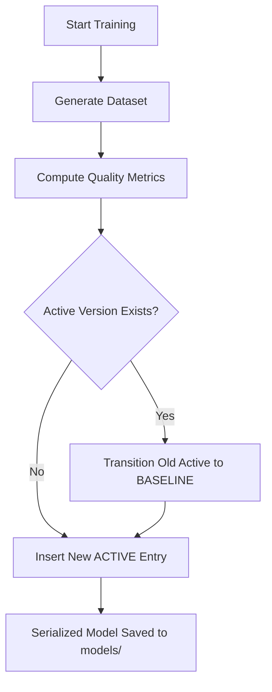

# Model Registry Architecture

The EconIQ Model Registry acts as the single source of truth for all machine learning models within the Stateful Behavioral Intelligence Platform. It catalogs trained models, baseline heuristics, versions, metadata, and performance metrics (AUC, F1, Precision, Recall, Brier score, ECE) to ensure demo safety, observability, and deterministic transitions.

## DB Schema (`model_registry`)

| Field | Type | Description |
| :--- | :--- | :--- |
| `id` | `VARCHAR` (PK) | Unique identifier (UUID). |
| `model_name` | `VARCHAR` | The name of the model (e.g., `distress_v1`, `recovery_v1`). |
| `version` | `VARCHAR` | Semantic version string (default `1.0.0`). |
| `status` | `VARCHAR` | One of `ACTIVE`, `BASELINE`, `EXPERIMENTAL`, `DEPRECATED`. |
| `trained_at` | `TIMESTAMP` | Timestamp of training run. |
| `dataset_rows` | `INTEGER` | Number of training rows in the historical sample. |
| `positives` | `INTEGER` | Count of positive outcomes in the training set. |
| `negatives` | `INTEGER` | Count of negative outcomes in the training set. |
| `auc` | `DOUBLE PRECISION` | ROC Area Under the Curve on test partition. |
| `f1` | `DOUBLE PRECISION` | Macro-F1 score on test partition. |
| `precision` | `DOUBLE PRECISION` | Classification precision. |
| `recall` | `DOUBLE PRECISION` | Classification recall. |
| `pr_auc` | `DOUBLE PRECISION` | Precision-Recall Curve AUC. |
| `brier` | `DOUBLE PRECISION` | Brier Score calibration metric. |
| `prediction_count` | `INTEGER` | Cumulative total of inferences run against this model. |
| `feedback_count` | `INTEGER` | Cumulative resolved prediction count. |
| `notes` | `TEXT` | Free-form operational notes (e.g. features list, hyperparameters). |

## Registry Workflow & Transitions

## API Endpoints

- `GET /api/v1/ml/models`: Retrieves metadata for all registered models.
- `GET /api/v1/ml/models/{name}`: Retrieves metadata for a specific model by name.
- `GET /api/v1/ml/models/active`: Retrieves metadata for active models.
